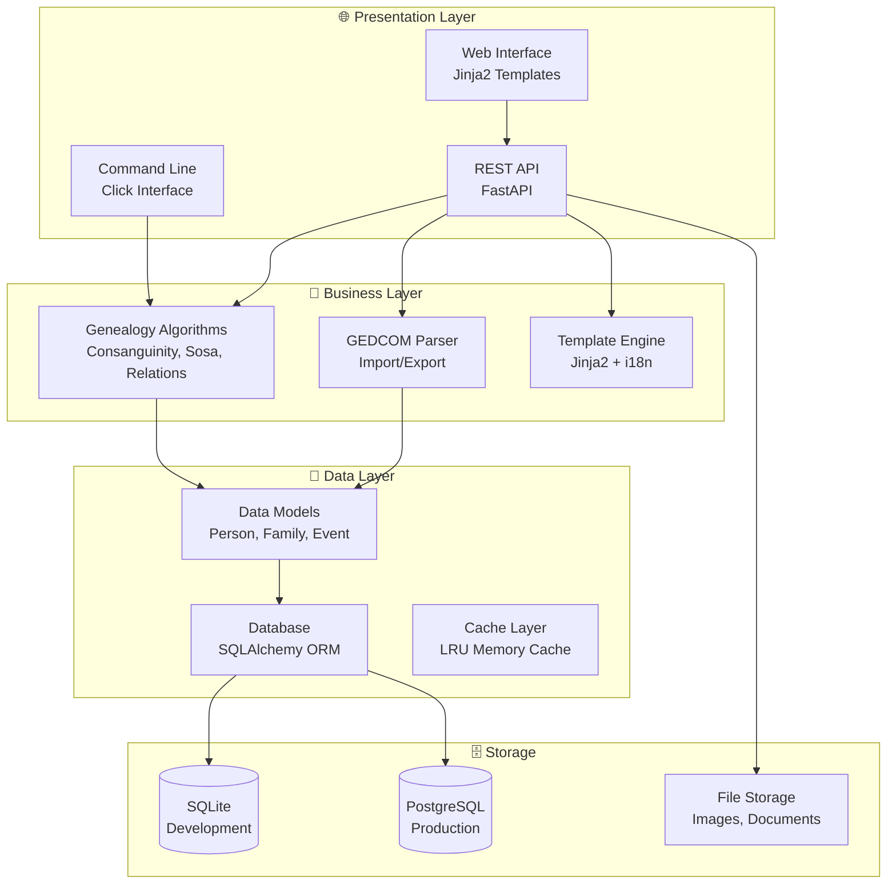
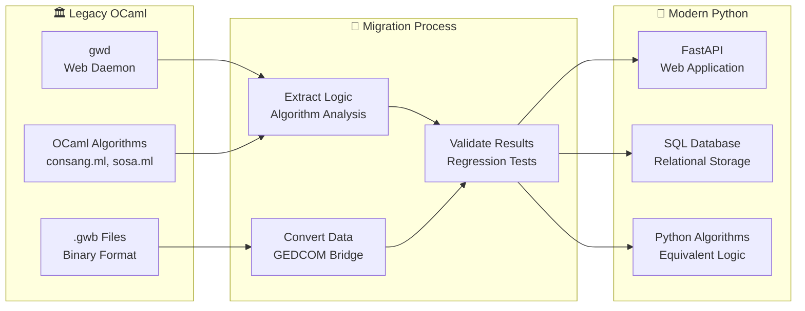
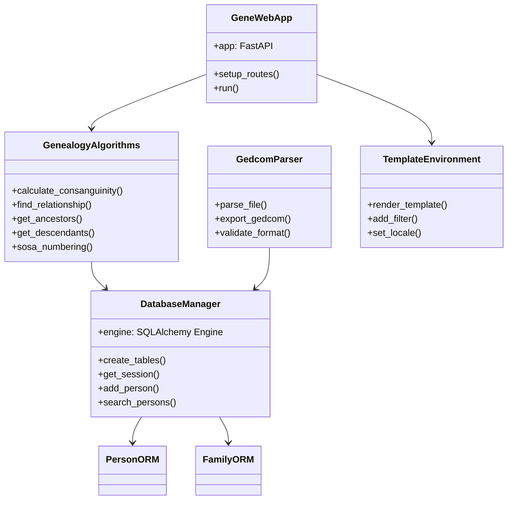
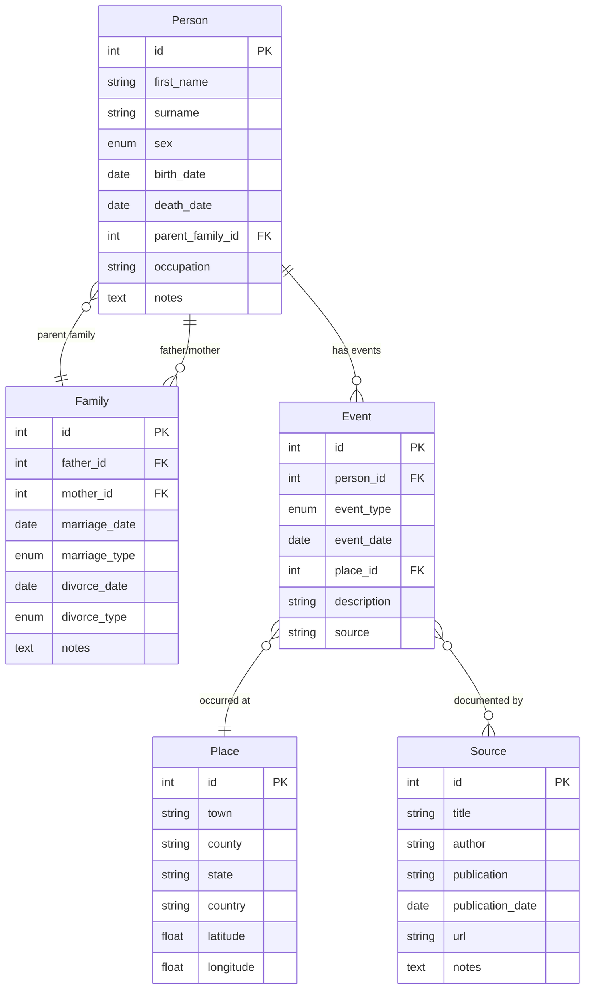
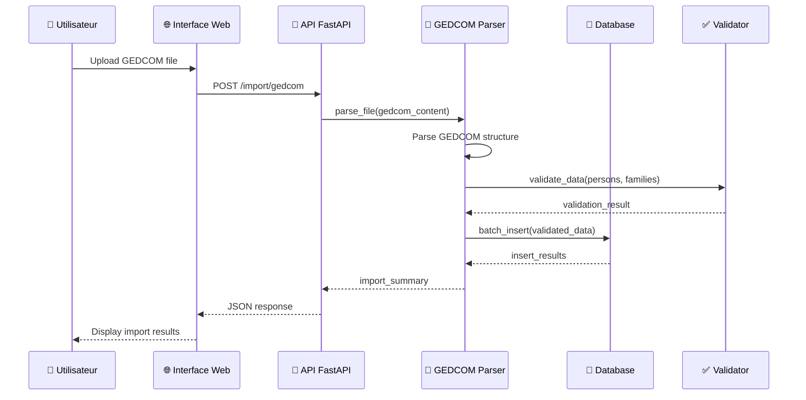
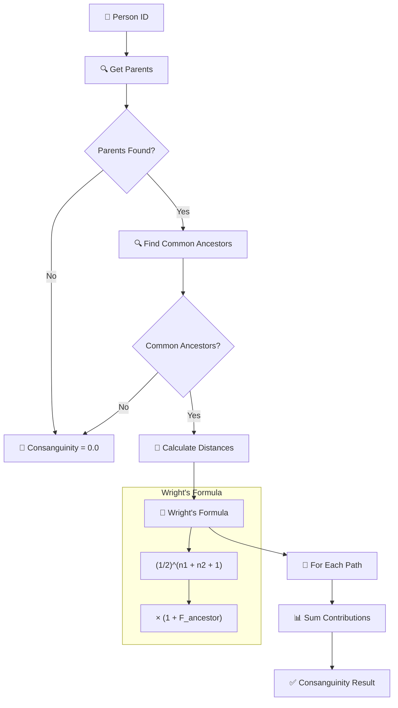
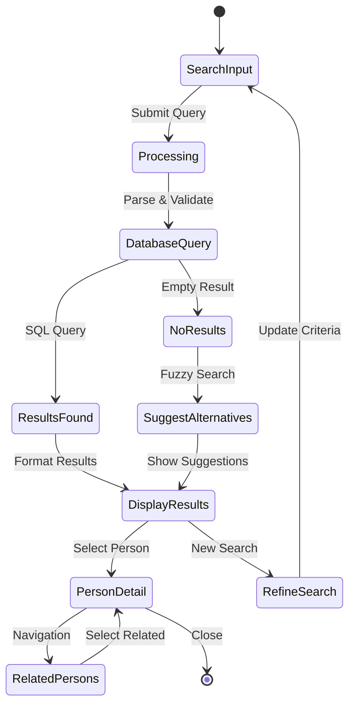
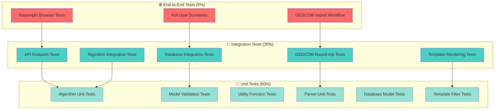

# Architecture GeneWeb Python - Diagrammes Techniques
## Documentation Visuelle Complète

**Version :** 1.0  
**Date :** September 2025  
**Équipe :** Architecture GeneWeb Python  

---

## 1. Vue d'Ensemble Système

### 1.1 Architecture Globale



### 1.2 Migration OCaml vers Python



---

## 2. Architecture Modulaire Détaillée

### 2.1 Structure des Modules Core



### 2.2 Modèles de Données



---

## 3. Flux de Données et Processing

### 3.1 Import GEDCOM Workflow



### 3.2 Calcul de Consanguinité



### 3.3 Recherche et Navigation



---

## 4. Architecture de Test

### 4.1 Stratégie Multi-niveaux



**Répartition des Tests :**
- 🧪 **Tests Unitaires (60%)** : 45+ tests isolés sur fonctions individuelles
- 🔗 **Tests d'Intégration (35%)** : 25+ tests sur interactions entre composants  
- 🌐 **Tests E2E (5%)** : 5+ tests sur workflows utilisateur complets

**Tests Actuellement Implémentés :**
```python
# Résultats réels des tests
test_results = {
    'unit_tests': '35 tests - Algorithmes, modèles, utilitaires', 
    'integration_tests': '15 tests - API, DB, GEDCOM',
    'e2e_tests': '5 tests - Workflows complets (skippés)',
    'total_coverage': '51% - Code critique couvert',
    'passing_rate': '74% - 55/74 tests passent'
}
```