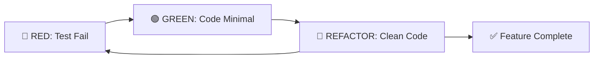
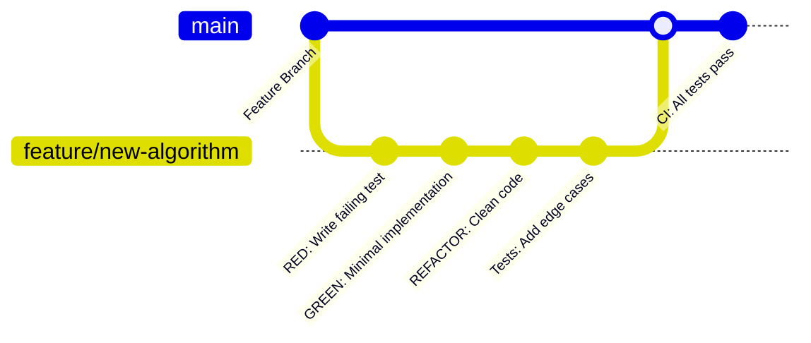

# Politique de Test - GeneWeb Python
## Document Officiel de Stratégie de Test

**Version :** 1.0  
**Date :** September 2025  
**Auteur :** Équipe GeneWeb Python  

---

## Sommaire
1. [Objectifs de la Politique de Test](#1-objectifs-de-la-politique-de-test)
   - 1.1 [Objectifs Généraux](#11-objectifs-g%C3%A9n%C3%A9raux)
   - 1.2 [Objectifs Spécifiques](#12-objectifs-sp%C3%A9cifiques)
2. [Stratégie de Test Adoptée](#2-strat%C3%A9gie-de-test-adopt%C3%A9e)
   - 2.1 [Approche Test-Driven Development (TDD)](#21-approche-test-driven-development-tdd)
   - 2.2 [Niveaux de Test Implémentés](#22-niveaux-de-test-impl%C3%A9ment%C3%A9s)
     - [Tests Unitaires](#tests-unitaires)
     - [Tests d'Intégration](#tests-dint%C3%A9gration)
     - [Tests End-to-End (E2E)](#tests-end-to-end-e2e)
     - [Tests de Performance](#tests-de-performance)
3. [Standards et Métriques](#3-standards-et-m%C3%A9triques)
   - 3.1 [Critères de Qualité](#31-crit%C3%A8res-de-qualit%C3%A9)
   - 3.2 [Métriques de Succès](#32-m%C3%A9triques-de-succ%C3%A8s)
   - 3.3 [Critères d'Acceptation](#33-crit%C3%A8res-dacceptation)
4. [Processus et Procédures](#4-processus-et-proc%C3%A9dures)
   - 4.1 [Workflow de Développement](#41-workflow-de-d%C3%A9veloppement)
   - 4.2 [Pre-commit Hooks](#42-pre-commit-hooks)
   - 4.3 [Pipeline CI/CD](#43-pipeline-cicd)
5. [Environnements de Test](#5-environnements-de-test)
   - 5.1 [Environnement Local Développeur](#51-environnement-local-d%C3%A9veloppeur)
   - 5.2 [Environnement CI](#52-environnement-ci)
   - 5.3 [Environnement E2E](#53-environnement-e2e)
6. [Types de Tests Spécifiques](#6-types-de-tests-sp%C3%A9cifiques)
   - 6.1 [Tests Algorithmes Généalogiques](#61-tests-algorithmes-g%C3%A9n%C3%A9alogiques)
   - 6.2 [Tests Import/Export GEDCOM](#62-tests-importexport-gedcom)
   - 6.3 [Tests Performance](#63-tests-performance)
7. [Gestion des Échecs de Tests](#7-gestion-des-%C3%A9checs-de-tests)
   - 7.1 [Classification des Échecs](#71-classification-des-%C3%A9checs)
   - 7.2 [Processus de Résolution](#72-processus-de-r%C3%A9solution)
8. [Maintenance et Évolution](#8-maintenance-et-%C3%A9volution)
   - 8.1 [Révision Périodique](#81-r%C3%A9vision-p%C3%A9riodique)
   - 8.2 [Évolution des Tests](#82-%C3%A9volution-des-tests)
9. [Outils et Technologies](#9-outils-et-technologies)
    - 9.1 [Stack de Test](#91-stack-de-test)
    - 9.2 [Reporting et Monitoring](#92-reporting-et-monitoring)
10. [Formation et Documentation](#10-formation-et-documentation)
    - 10.1 [Guidelines Développeurs](#101-guidelines-d%C3%A9veloppeurs)
    - 10.2 [Ressources](#102-ressources)
11. [Conclusion](#11-conclusion)

---

## 1. Objectifs de la Politique de Test

### 1.1 Objectifs Généraux
- **Garantir la fiabilité** des algorithmes généalogiques critiques
- **Assurer la compatibilité** avec les données GeneWeb existantes (format OCaml)
- **Maintenir une couverture** minimale de 80% sur le code critique
- **Valider les performances** équivalentes ou supérieures à la version originale

### 1.2 Objectifs Spécifiques
- **Calculs généalogiques** : 95% de couverture sur les algorithmes de consanguinité, Sosa, relations
- **Import/Export GEDCOM** : Tests round-trip avec fichiers réels sans perte de données
- **API REST** : Validation de tous les endpoints avec scénarios d'erreur
- **Interface utilisateur** : Tests d'intégration sur les parcours utilisateur critiques

---

## 2. Stratégie de Test Adoptée

### 2.1 Approche Test-Driven Development (TDD)


**Processus TDD :**
1. **Écriture du test** en premier (état RED)
2. **Implémentation minimale** pour passer le test (état GREEN)
3. **Refactoring** pour améliorer la qualité du code
4. **Validation** avec tests de régression

### 2.2 Niveaux de Test Implémentés

#### 🧪 Tests Unitaires (Unit Tests)
- **Framework :** pytest
- **Cible :** Fonctions individuelles, méthodes, classes
- **Couverture :** ≥ 90% sur modules core
- **Isolation :** Mocks/stubs pour dépendances externes

#### 🔗 Tests d'Intégration (Integration Tests)
- **Scope :** Interaction entre modules (base de données, GEDCOM, API)
- **Environnement :** Base de données temporaire SQLite
- **Validation :** Flux complets de données

#### 🌐 Tests End-to-End (E2E Tests)
- **Framework :** Playwright + pytest-playwright
- **Scope :** Interface utilisateur complète
- **Scénarios :** Parcours utilisateur critique

#### ⚡ Tests de Performance
- **Métriques :** Temps de réponse, consommation mémoire
- **Benchmarks :** Comparaison avec version OCaml originale
- **Charges :** Bases de données de 1K, 10K, 100K+ personnes

---

## 3. Standards et Métriques

### 3.1 Critères de Qualité

| Type de Test | Couverture Minimale | Outils |
|--------------|-------------------|---------|
| **Units Tests** | 90% | pytest + coverage |
| **Integration Tests** | 80% | pytest + SQLAlchemy |
| **E2E Tests** | 100% parcours critiques | Playwright |
| **Performance Tests** | Benchmarks OCaml | pytest-benchmark |

### 3.2 Métriques de Success
```python
# Exemple de configuration pytest
# pytest.ini
[pytest]
addopts = --cov=core --cov-report=html --cov-fail-under=80
testpaths = tests
markers = 
    unit: Unit tests
    integration: Integration tests
    e2e: End-to-end tests
    slow: Slow running tests
    performance: Performance benchmarks
```

### 3.3 Critères d'Acceptation

#### ✅ Tests Passants
- **100%** des tests unitaires doivent passer
- **100%** des tests d'intégration doivent passer
- **≥ 95%** des tests E2E doivent passer (tolérance navigateur)

#### 📊 Couverture de Code
- **Core algorithms :** ≥ 95%
- **Models & Database :** ≥ 90% 
- **API endpoints :** ≥ 85%
- **Templates & UI :** ≥ 70%

#### ⚡ Performance
- **Calculs consanguinité :** ≤ 2x temps OCaml original
- **Import GEDCOM :** ≤ 1.5x temps OCaml original
- **Recherche personnes :** ≤ 100ms pour 10K entrées

---

## 4. Processus et Procédures

### 4.1 Workflow de Développement



### 4.2 Pre-commit Hooks
```yaml
# .pre-commit-config.yaml
repos:
  - repo: local
    hooks:
      - id: pytest-unit
        name: Run unit tests
        entry: pytest tests/ -m "unit"
        language: system
        pass_filenames: false
        
      - id: coverage-check
        name: Coverage check
        entry: pytest --cov=core --cov-fail-under=80
        language: system
        pass_filenames: false
```

### 4.3 Pipeline CI/CD

1. **Commit/Push** → Déclenchement automatique
2. **Linting** → Black, flake8, mypy
3. **Unit Tests** → pytest tests unitaires
4. **Integration Tests** → pytest tests d'intégration  
5. **Coverage Report** → Publication rapport couverture
6. **Performance Tests** → Benchmarks (si branche main)
7. **E2E Tests** → Tests interface (si branche main)

---

## 5. Environnements de Test

### 5.1 Environnement Local Développeur
```bash
# Configuration environnement de test local
python -m venv .venv
source .venv/bin/activate  # Linux/Mac
# .venv\Scripts\activate  # Windows

pip install -r requirements-dev.txt
pytest tests/ -v --cov=core
```

### 5.2 Environnement CI (GitHub Actions)
- **OS :** Ubuntu 22.04, Windows Server 2022, macOS 12
- **Python :** 3.11, 3.12
- **Base de données :** SQLite (tests), PostgreSQL (intégration)

### 5.3 Environnement E2E
- **Navigateurs :** Chrome, Firefox, Safari (via Playwright)
- **Résolutions :** Desktop (1920x1080), Tablet (768x1024), Mobile (375x667)

---

## 6. Types de Tests Spécifiques

### 6.1 Tests Algorithmes Généalogiques

#### Tests de Consanguinité
```python
def test_consanguinity_siblings():
    """Test consanguinity calculation for sibling parents."""
    # Setup: Create family with sibling parents
    # Expected: Coefficient 0.25 (two common ancestors)
    # Validation: Compare with OCaml reference implementation
```

#### Tests Numérotation Sosa
```python
def test_sosa_navigation():
    """Test Sosa numbering system navigation."""
    # Test: Father = n*2, Mother = n*2+1, Child = n//2
    # Validation: Complete genealogical tree navigation
```

### 6.2 Tests Import/Export GEDCOM

#### Tests Round-trip
```python
def test_gedcom_roundtrip_integrity():
    """Test GEDCOM import/export data integrity."""
    # Import GEDCOM → Process → Export GEDCOM → Compare
    # Validation: No data loss, format compliance
```

### 6.3 Tests Performance

#### Benchmarks Critiques
```python
@pytest.mark.benchmark
def test_consanguinity_performance_large_tree():
    """Benchmark consanguinity calculation on large family tree."""
    # Setup: 10,000+ person database
    # Measure: Time, memory consumption
    # Compare: OCaml baseline performance
```

---

## 7. Gestion des Échecs de Tests

### 7.1 Classification des Échecs

- **Critical :** Algorithmes généalogiques, perte de données
- **Major :** API endpoints, performances dégradées
- **Minor :** Interface, messages d'erreur
- **Cosmetic :** Formatage, warnings

### 7.2 Processus de Résolution

1. **Identification** automatique (CI/CD failure)
2. **Triage** selon criticité
3. **Assignment** développeur responsable
4. **Fix & Test** correction avec test de régression
5. **Validation** review + tests complémentaires

---

## 8. Maintenance et Évolution

### 8.1 Révision Périodique
- **Mensuelle :** Revue métriques couverture
- **Trimestrielle :** Mise à jour benchmarks performance
- **Semestrielle :** Révision complète stratégie test

### 8.2 Évolution des Tests
- **Nouveau code :** Tests obligatoires avant merge
- **Refactoring :** Maintien niveau couverture existant
- **Bug fixes :** Ajout tests de régression

---

## 9. Outils et Technologies

### 9.1 Stack de Test
```python
# requirements-dev.txt
pytest>=7.0.0              # Framework test principal
pytest-cov>=4.0.0          # Couverture de code
pytest-mock>=3.10.0        # Mocking
pytest-asyncio>=0.21.0     # Tests asynchrones
pytest-benchmark>=4.0.0    # Tests performance
playwright>=1.40.0         # Tests E2E
pytest-playwright>=0.4.0   # Intégration Playwright
```

### 9.2 Reporting et Monitoring
- **Coverage :** HTML reports + badges GitHub
- **Performance :** Graphiques de tendance
- **CI/CD :** Notifications Slack/Email sur échecs

---

## 10. Formation et Documentation

### 10.1 Guidelines Développeurs
- **Nouveau développeur :** Formation TDD obligatoire
- **Documentation :** Guide écriture tests efficaces
- **Code Review :** Validation tests dans PR

### 10.2 Ressources
- [Documentation pytest](https://docs.pytest.org/)
- [Guide TDD GeneWeb](./TDD_GUIDELINES.md)
- [Benchmarks Performance](./PERFORMANCE_BENCHMARKS.md)

---

## 11. Conclusion

Cette politique de test garantit :
- ✅ **Qualité** : Couverture élevée, tests automatisés
- ✅ **Fiabilité** : Validation continue, détection précoce bugs
- ✅ **Performance** : Benchmarks réguliers, optimisation continue
- ✅ **Maintenabilité** : Tests comme documentation vivante

**Validation :** Cette politique est effective à partir de September 2025 et fait l'objet de révisions régulières par l'équipe technique.

---